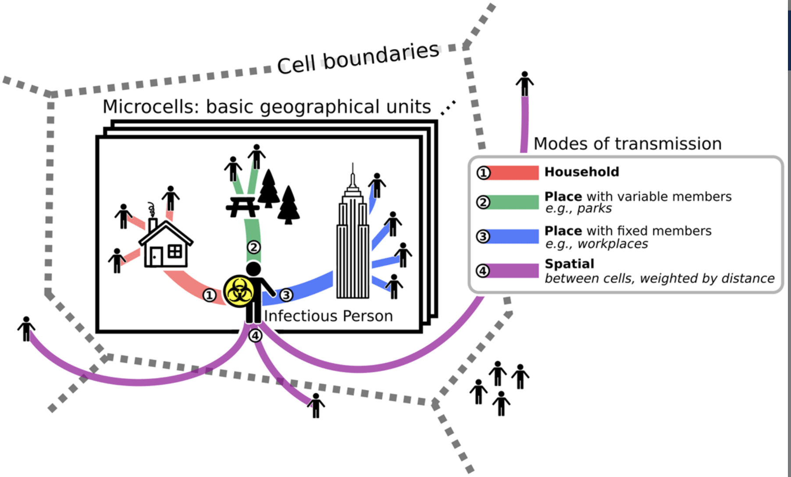
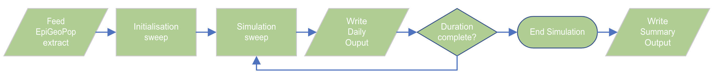

ADD BADGES
# rEpiabm
rEpiabm enables users familiar with R to use Epiabm (ADD LINK). Epiabm is a simulation tool that models the progress of an epidemic across a specified region of interest within a specific timeframe. It has been developed in python for small-scale implementations and C++ for fast, large-scale simulations. PyEpiabm design is modular, with many options to configure specific requirements.

## Summary of Epiabm functionality

### Basic Architecture
To model an epidemic, contact events are represented by the population spatial structure (see Figure 1.). The transmission of the disease and its progression within host is represented by a compartment model (see Figure 2.). These two architectures are highly configurable; this allows us to study a wide range of simulation scenarios.

<div style="display: flex; gap: 20px;">
  <div style="flex: 1;">
    
    <p><figcaption><i>Figure 1. Population Spatial Structure: The environment is modelled using <a href="https://github.com/SABS-R3-Epidemiology/EpiGeoPop">EpiGeoPop</a>, which takes a region of interest, creates layers of sub-regions of different types and populates these with individuals.</p><figcaption><i>
  </div>
  <div style="flex: 1;">
    
    <p><figcaption><i>Figure 2. Infection Progression: The infection progression is represented using a <a href="https://en.wikipedia.org/wiki/Compartmental_models_in_epidemiology">compartment model</a> which tracks the daily progress of the disease within an individual.<i><figcaption></p>
  </div>
</div>

## Running a simulation
The basic flow of a simulation is described below and an overview of the process is illustrated in Figure 4. The instructions to run a basic simulation is also given; we will use 'Andorra' as the region of interest. A more detailed, complex example is illustrated in this jupyter notebook (ADD LINK). Also, [the Wiki](https://github.com/SABS-R3-Epidemiology/epiabm/wiki/Overview-of-the-Ferguson-Model) details optional parameters available to the user as well as those whose values are mentioned, but changing them is not recommended.

<figure>
    
    <figcaption><i>Figure 4. Overview of simulation workflow: These steps are required to run a simulation.</i></figcaption>
</figure>


### Step 1: Set up rEpiabm
Before running a simulation, rEpiabm needs to be installed with all dependencies mentioned in the DESCRIPTION file. Also, the folder structure used by the R program file needs to be set up for your region of interest.

**Instructions:**
1. Go to your github personal Settings/Developer Settings
2. Create a new personal access token (fine-grained)
3. Launch RStudio and type:
```file.edit("~/.Renviron")```

4. In the file add the line:

    ```GITHUB_PAT=your_personal_access_token```

  where the above is your real token from github
5. Restart RStudio
6. Enter in R terminal:

  ```
  install.packages("devtools")
  devtools::install_github("SABS-R3-Epidemiology/rEpiabm")
  ```
7. Copy the example 'Andorra' folder structure within the data folder and name it with your region of interest (include the files as you will need to edit these for your simulation).

You are now ready to configure a simulation.


### Step 2: Use EpiGeoPop to generate the population spatial structure
As shown in Figure 1, the region of interest is broken into a spatial structure:
* *Cells* - largest areas, based on a fixed width
* *Microcells* - cells are split into microcells which contain smaller areas containing individuals
* *Households* - quantity per microcell is based on a probabilistic distribution. All individuals are assigned to one household and do not move households during the simulation.
* *Places* - quantity per microcell is based on a probabilistic distribution. These are spaces where individuals might meet other individuals from different households, a workplace or a public park for example.

This structure is created using [EpiGeoPop](https://github.com/SABS-R3-Epidemiology/EpiGeoPop). The user states a region of interest, Oxford or UK for example, and the tool extracts information from [Natural Earth](https://www.naturalearthdata.com/) and [JRC](https://data.jrc.ec.europa.eu/csv), providing a csv file as output. This file contains one line per microcell for each cell, with the number of households, places and individuals to be used in the simulation (the quantity of individuals are extracted from Census data).

**Instructions:**

1. Go to [EpiGeoPop](https://github.com/SABS-R3-Epidemiology/EpiGeoPop) repository and follow the instructions to extract a csv file of your required region.

**NB:** The json file which you amend to put the name your country also needs the proportion of households with 1 individual, 2 individuals, 3 individuals... upto 10 individuals. This information is usually found using census data (or equivalent) for your region. Amend the json file as described in the jupyter notebook (ADD REF). 

2. Copy the extracted file to the new folder data/region_name/inputs

**NB:** At the time of writing, the tool did not extract the data successfully. Please follow the instructions in this jupyter notebook (ADD reference)

In summary, the spatial structure for a region is generated using EpiGeoPop. This tool exports into a csv file the number of households, places, and individuals for each microcell. It also produces a Population Density map in the ```outputs/countries/<your_country>.pdf```, an example of Andorra shown in Figure 4.

FIGURE 4

### Step 3: Configure the simulation
The following parameters are essential and need to be stated by the user to run a simulation:

* Name of the path to the csv file from EpiGeoPop
* Number of infected individuals (Imild): enter the number of infected individuals at the start of the simulation.
* Proportion of households with 1 individual, 2 individuals, 3 individuals... upto 10 individuals. This information is usually found using census data (or equivalent) for your region.
* Time for the simulation to run (in days)
* Select any output options required

**Instructions:**
1. Open your version of *Andorra_parameters.json*
 (copied from 'Andorra' in Step 1 above) and save with your country's name (keep first letter capitalised).
2. Amend the parameter array household_size_distribution to have your countries' distribution used in step 2. 
 3. Open *andorra_simulation_flow.R* and amend:
 * file_loc: the absolute path to your csv file exported from EpiGeoPop
 * initial_infected_number: in sim_param list, enter the number of infected individuals at the start of the simulation.
 * simulation_end_time: in sim_param list, enter the time for the simulation to run (in days)
 * amend ```Andorra``` in final line with your country.

 More detailed instructions are available in the jupyter notebook (ADD REF) and further optional parameters are described in [the Wiki](https://github.com/SABS-R3-Epidemiology/epiabm/wiki/Overview-of-the-Ferguson-Model)

**Common adjustments:**
* At the start, infected individuals are distributed across all cells by default, you may want to put them in one cell.
* Maximum infection radius: this sets a maximum distance for the infection to be able to spread from cell to cell
* Age distribution used is required
* Outputs to evaluate simulation (see Step 4: Evaluate Results)

### Step 4: Run the simulation
Once configured, the simulation takes the generated population and performs the following  ‘sweeps’:

**Initialisation sweeps:**
* InitialHouseholdSweep - Assign individuals to households
* InitialisePlaceSweep - Assign individuals to places
* InitialInfectedSweep - Assign which individuals are initially infected

There are optional modules such as recording demographics, which are described in [the Wiki](https://github.com/SABS-R3-Epidemiology/epiabm/wiki/Overview-of-the-Ferguson-Model)

**Simulation sweeps:**

Individual’s location and infection status is updated each day:
* UpdatePlaceSweep - Account for movement of individuals by refreshing their ‘place’ assignments
* Check each infected individual to see if they infect others:
  * HouseholdSweep - At a household
  * PlaceSweep - At a place
* SpatialSweep - Between cells
* QueueSweep - Any successful infections will update the newly infected person’s status from S (Susceptible) to E (Exposed).
* HostProgressionSweep - Individual’s Infection progress is updated using the compartmental model

**Instructions:**
1. After saving the configured file *andorra_simulation_flow.R*, run this code!

### Step 5: Evaluate results
A simulation produces one csv output file by default, found in data/<your_country>/simulation_outputs. This file contains the number of individuals for each infection status (S, E, I<sub>mild</sub>, etc) for each day.

It also produces a SI<sub>mild</sub>RD plot, which shows the overall progression of each status for the duration of the simulation.

Further optional files are available, details described in [the Wiki](https://github.com/SABS-R3-Epidemiology/epiabm/wiki/Overview-of-the-Ferguson-Model) or see jupyter notebook with a detailed illustration here . These data files can be used to produce plots for further analysis.

